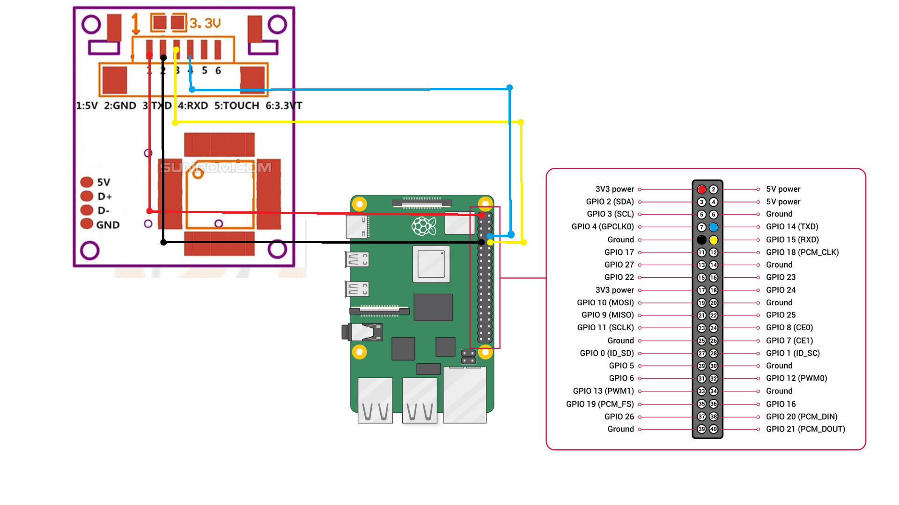

# Biometric-based Electronic Voting Machine_RaspberryPi
This project is a Biometric Electronic Voting Machine (EVM) that uses fingerprint verification to ensure that only eligible voters can cast their vote. The project is built using a Raspberry Pi 4 Model B and an R307 Fingerprint Sensor.

- The main.py file contains the source code for this project.

# Hardware Used
- Raspberry Pi 4 Model B
- R307 Fingerprint Sensor
- 3.3V 2A Power + Type-C
- USB - TTL Converter (CP2102, CH9102, etc) (Optional)

# Software Requirements
The following Python libraries are required for this project:

- pillow==10.3.0
- pyfingerprint==1.5
- pyserial==3.5
- Tkinter

These are specified in the requirements.txt file.

# Hardware Connections 
The R307 Fingerprint Sensor can be connected either to 3V or 5V. It can operate at both voltages.
The R307 is connected serially here but it can be connected through an USB-TTL Converter such as CP2102, CH9102, etc. When connected through USB , the path of the sensor has to be changed accordingly in the program.

# How the EVM Works
1. Initialisation : The Raspberry Pi initializes the fingerprint sensor to ensure it is working correctly.
2. Verification :
   - The voter places their finger on the fingerprint sensor.
   - The sensor checks if the fingerprint matches any stored in its memory.
   - If a match is found, and the voter has not already voted, the voter is allowed to proceed.
   - If no match is found or the voter has already voted, an appropriate message is displayed.
4. Voting :
   - After successful verification, the voter selects their preferred party by clicking a button on the screen.
   - The vote is recorded and saved to a file named voting_results.txt.
6. Result :
   - Another part of the software reads the voting_results.txt file and displays the voting results in a separate window.

# References
- R307 datasheet - https://www.rajguruelectronics.com/Product/1276/R307%20Fingerprint%20Module.pdf
- Raspberry PI - https://www.raspberrypi.com/documentation/computers/raspberry-pi.html
- PyFingerprint - https://pyfingerprint.readthedocs.io/en/latest/
- PyFingerprint Github - https://github.com/bastianraschke/pyfingerprint
   
